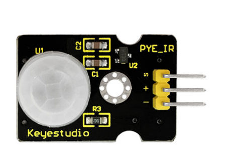
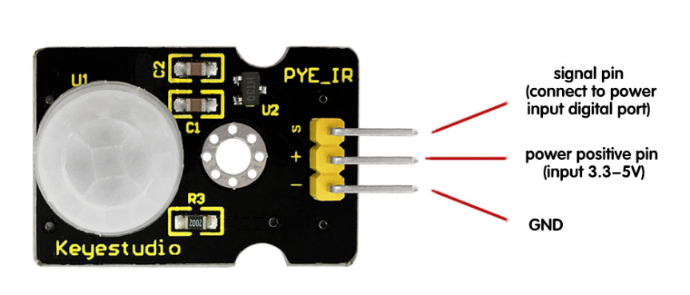
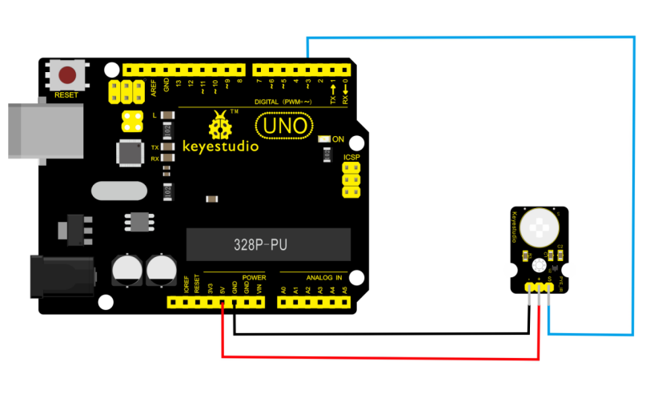
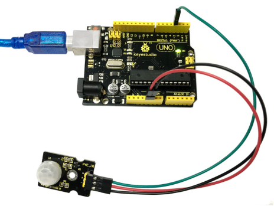
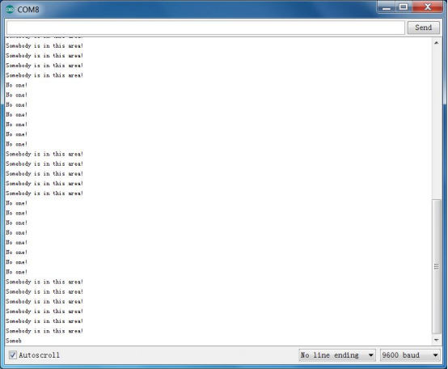

# KS0052 keyestudio PIR Motion Sensor



## 1. Introduction

The Pyroelectric infrared motion sensor can detect infrared signals from a moving person or moving animal, and output switching signals. It can be applied to a variety of occasions to detect the movement of human body. 

Conventional pyroelectric infrared sensors are much more bigger, with complex circuit and lower reliability. 

Now we launch this new pyroelectric infrared motion sensor, specially designed for Arduino. This sensor integrates an integrated digital pyroelectric infrared sensor, and the connection pins. It features higher reliability, lower power consumption and simpler peripheral circuit.

**Special note：**

1. The maximum distance is 3-4 meters during testing.
2. When testing, first open the white lens, you can see the rectangular sensing part. When the long line of the rectangular sensing part is parallel to the ground, the distance is the best.
3. When testing, the sensor needs to be covered with white lens, otherwise it will affect the distance.
4. The distance is best at 25℃, and the detection distance is shortened when it exceeds 30℃.
5. Done powering up and uploading the code, you need to wait 5-10 seconds then start testing, otherwise it is not sensitive.

## 2. Features

- smaller size and light weight
- higher reliability
- lower power consumption
- simpler peripheral circuit

## 3. Parameters

- Input Voltage: DC 3.3V~18V
- Working Current: 15uA
- Working Temperature: -20 ~ 85 ℃
- Output Voltage: High 3V, Low 0V
- Output Delay Time (High Level): About 2.3 to 3 Seconds
- Detection Angle: 100°
- Detection Distance: 3-4 meters
- Output Indicator LED (If it is HIGH level, it will be ON)
- Pin Limit Current: 100mA

## 4. PINOUT



## 5. Wire it Up

Connect the S pin of module to Digital 3 of UNO board, connect the negative pin to GND port, positive pin to 5V port.



## 6. Sample Code

Download code:  [Code](./Code.7z)

Below is an example code, you can upload it to Arduino IDE.

```
byte sensorPin = 3;
byte indicator = 13;

void setup()
{
  pinMode(sensorPin,INPUT);
  pinMode(indicator,OUTPUT);
  Serial.begin(9600);
}

void loop()
{
  byte state = digitalRead(sensorPin);
  digitalWrite(indicator,state);
  if(state == 1)Serial.println("Somebody is in this area!");
  else if(state == 0)Serial.println("No one!");
  delay(500);
}
```

## 7. Example Result



Done wiring and powered up, upload well the code, if the sensor detects someone moving nearby, D13 indicator on UNO board will light up, and "Somebody is in this area!" is displayed on the serial monitor.

If no movement, D13 indicator on UNO board not lights, and "No one!" is displayed on the serial monitor.

